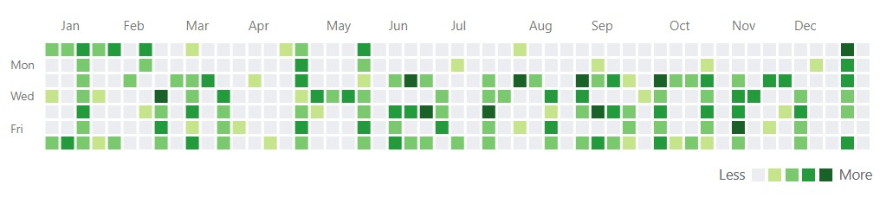

<picture>
 
</picture>

---

### hey 👋, i'm [Hanson Sun](https://hanson-sun.github.io/) and i'm a big fan of computer science

I code sometimes and document my programming journey here---have fun exploring!

### Feel Free To Reach Out!
- email me at [hansonsun.school@gmail.com](hansonsun.school@gmail.com)
- start a linkedin game competition with me on [LinkedIn](https://www.linkedin.com/in/hanson-sun/)
- check out my website [hanson-sun.github.io](https://hanson-sun.github.io/)

<!-- <table border="0">

 <tr>
    <td></td>
    <td></td>
 </tr>
</table> -->
