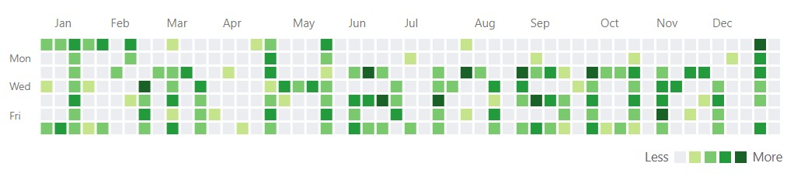

<picture>
 
</picture>

    
    

    
    
    
    <!---->
    
    
    
    

---

### Hey 👋, I'm [Hanson Sun](https://hanson-sun.github.io/), a student from BC, Canada! I current study Computer Science with an intended minor in Data Science [@UBC](https://www.ubc.ca/). 

I code sometimes, and I document my programming journey here, have fun exploring! If I'm not glued to my computer, you might catch me biking :biking_man: or practicing the saxophone :saxophone: (but not both).

### :thinking: Recently, I have been:
- Seeking spring and summer 2024 internships :triumph: 
- Stressing about school :sweat_smile:
- Grinding leetcode! :slightly_smiling_face:

### Feel To Reach Out!
- :email: Email me at [hansonsun.school@gmail.com](hansonsun.school@gmail.com)
- 💬 Send me a message on [LinkedIn](https://www.linkedin.com/in/hanson-sun/) 

<table border="0">

 <tr>
    <td></td>
    <td></td>
 </tr>
</table>

<!--
**Hanson-Sun/Hanson-Sun** is a ✨ _special_ ✨ repository because its `README.md` (this file) appears on your GitHub profile.

Here are some ideas to get you started:

- 🔭 I’m currently working on ...
- 🌱 I’m currently learning ...
- 👯 I’m looking to collaborate on ...
- 🤔 I’m looking for help with ...
- 💬 Ask me about ...
- 📫 How to reach me: ...
- 😄 Pronouns: ...
- ⚡ Fun fact: ...
-->
